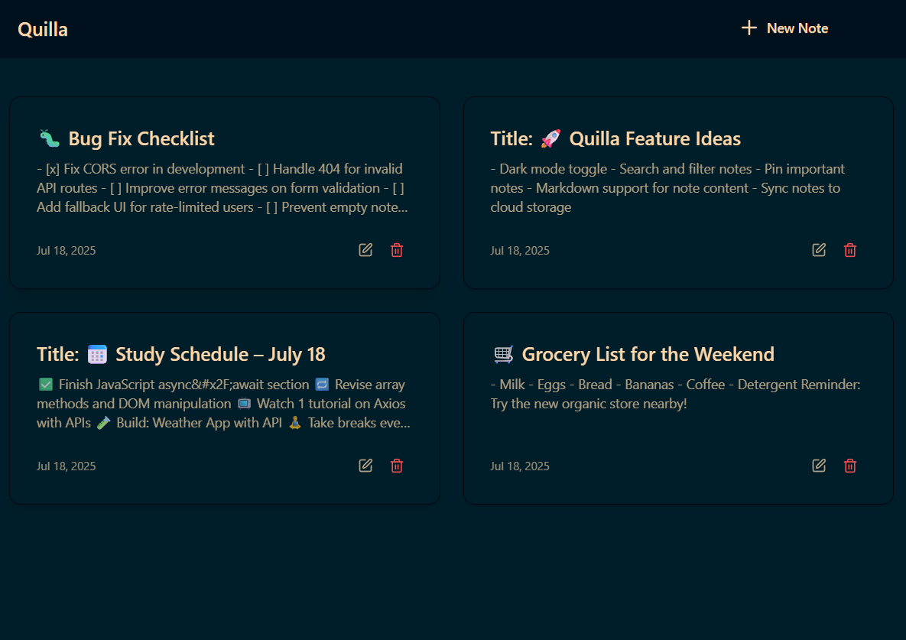
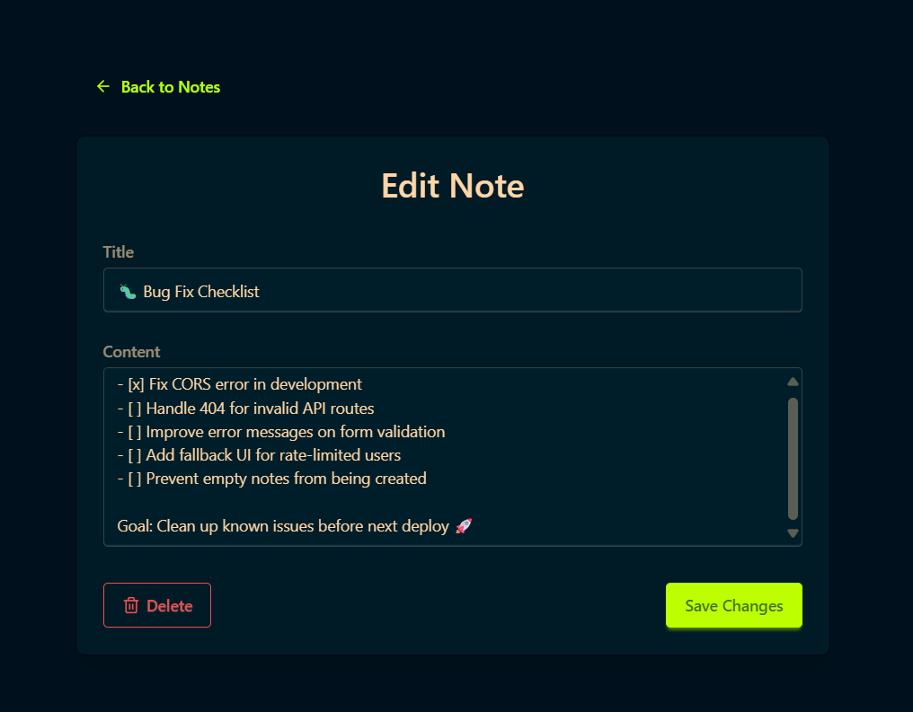
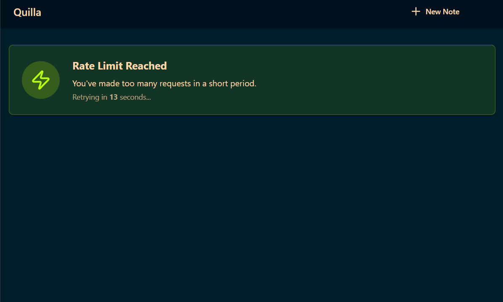

# Quilla

**Quilla** is a **full-stack note-taking application** designed for simplicity and efficiency. Built with a modern tech stack, it provides a seamless experience for managing your notes, complete with robust backend services and a sleek, responsive user interface.

---

## ✨ Features

- ✅ **CRUD Operations:** Create, Read, Update, Delete notes effortlessly.
- 🎨 **Intuitive UI:** Clean and responsive design using React, Tailwind CSS, and DaisyUI.
- 🧠 **Robust Backend:** Express.js and MongoDB ensure reliable and scalable performance.
- 🔐 **Rate Limiting:** Efficient API protection using Upstash Redis.
- 📣 **Real-time Toasts:** Instant feedback on user actions and errors with `react-hot-toast`.

---

## 🛠 Technologies Used

### 🔹 Frontend

- **React**
- **Vite**
- **React Router v7**
- **Tailwind CSS**
- **DaisyUI**
- **Axios**
- **react-hot-toast**

### 🔸 Backend

- **Node.js**
- **Express.js**
- **MongoDB + Mongoose**
- **Upstash Redis**
- **dotenv**
- **Nodemon**
- **CORS**

---

## 🖼️ App Preview

Here’s a preview of the Quilla UI:

<div style="display: flex; gap: 10px; flex-wrap: wrap; justify-content: center;">

  
  
  

</div>

```

## 📁 Project Structure

```

Quilla/
├── .github/
│ └── copilot-instructions.md
├── assets/
├── backend/
│ ├── src/
│ │ ├── config/
│ │ │ └── upstash.js
│ │ ├── controllers/
│ │ │ └── notesController.js
│ │ ├── middleware/
│ │ │ └── rateLimiter.js
│ │ ├── models/
│ │ │ └── note.js
│ │ ├── routes/
│ │ │ └── notesRoute.js
│ │ └── server.js
│ ├── .env.example
│ └── package.json
├── frontend/
│ ├── public/
│ ├── src/
│ │ ├── assets/
│ │ ├── components/
│ │ ├── libs/
│ │ ├── pages/
│ │ ├── App.jsx
│ │ ├── index.css
│ │ └── main.jsx
│ ├── index.html
│ ├── tailwind.config.js
│ └── package.json
├── package.json
└── README.md

````

## 🚀 Getting Started

Get a local copy of the project up and running for development and testing.

### 📋 Prerequisites

- [Node.js](https://nodejs.org/) (LTS recommended)
- npm (comes with Node.js)
- [MongoDB Atlas](https://www.mongodb.com/atlas/database) account (or a local MongoDB instance)
- [Upstash](https://upstash.com/) account (for Redis)

---

## 🔧 Installation

1. **Clone the repository:**

   ```bash
   git clone https://github.com/bharathsai369/Quilla.git
   cd Quilla
````

2. **Install dependencies (both frontend and backend):**

   ```bash
   npm install
   ```

---

## 🧪 Environment Setup

Create a `.env` file inside the `backend/` directory:

```env
# MongoDB
MONGO_URI=<your_mongodb_connection_string>

# Upstash Redis
UPSTASH_REDIS_REST_URL=<your_upstash_redis_rest_url>
UPSTASH_REDIS_REST_TOKEN=<your_upstash_redis_rest_token>

# Environment
NODE_ENV=development
```

> 🔐 Replace placeholders with your actual credentials.

---

## 🏃 Running the App Locally

### Backend (dev mode)

```bash
cd backend
npm run dev
```

Runs on `http://localhost:5001`

### Frontend (dev mode)

```bash
cd frontend
npm run dev
```

Runs on `http://localhost:5173`

---

## 📦 Building for Production

1. **Build frontend:**

   ```bash
   npm run build
   ```

   This will generate `frontend/dist`.

2. **Serve full-stack app:**

   ```bash
   npm start
   ```

This command serves the static frontend via Express and starts the backend API.

---
